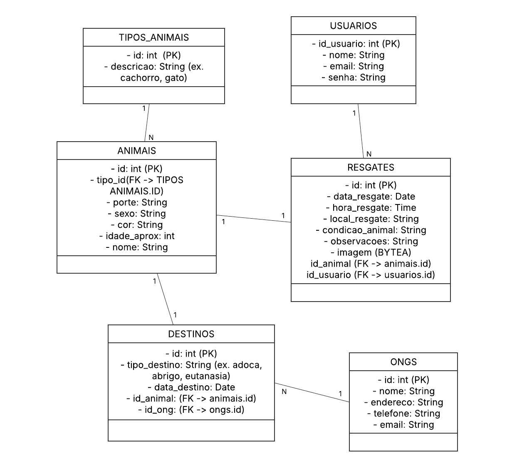

# Marco I (05/06/2025)
## Documento de visão e escopo do projeto

# 📄 [Documento de Visão e Escopo do Projeto](https://docs.google.com/document/u/0/d/1qjjMRAi0r5dX0_2HXAFSymZn6uCUqTl2TGxotNqha_0/mobilebasic?urp=gmail_link) 
**Resgata Pet Crateús**  
**Versão:** 1.0 

---

## 1. Objetivo do Projeto  
Desenvolver um sistema tem como objetivo principal registrar, organizar e permitir o gerenciamento de informações relacionadas a resgates de animais. Ele será utilizado por equipes de resgate, ONGs, voluntários ou órgãos públicos responsáveis por essas atividades, visando facilitar o controle, o histórico e a análise dos resgates realizados.

---

## 2. Escopo do Projeto

### 2.1 Requisitos Funcionais

1. **Cadastro de Resgates de Animais**  
   - Registro com: tipo de animal, data e hora, localização, responsável, condição do animal, observações e imagem.  

2. **Consulta e Gerenciamento de Resgates**  
   - Listagem em formato de tabela  
   - Edição e exclusão de registros  
   - Filtros por:
     - Tipo de animal  
     - Data  
     - Responsável  
   - Exportação da lista em CSV ou PDF  

3. **Cadastro e Acesso de Usuários**  
   - Registro de voluntários e responsáveis  
   - Login com e-mail e senha  
   - Exibição do nome e e-mail do usuário logado  
   - Edição dos próprios dados  
   - Logout  

4. **Controle de Acesso**  
   - Funcionalidades acessíveis apenas a usuários autenticados  
---

## 3. Requisitos Não Funcionais

5. **Compatibilidade e Execução Local**  
   - Funcionamento em ambiente desktop Windows (opcionalmente Linux)  
   - Entregue em instalador simples ou executável, sem necessidade de internet  

6. **Interface e Usabilidade**  
   - Interface gráfica simples e intuitiva  
   - Menus e botões com identificação clara  

7. **Desempenho e Eficiência**  
   - Início do sistema em menos de 5 segundos em computadores básicos  
   - Baixo consumo de memória e processamento  

8. **Armazenamento de Dados**  
   - Dados armazenados localmente em banco leve (ex: SQLite)  
   - Garantia contra perda de dados com salvamento automático ou confirmação de gravação  
---
## 4. Priorização de Requisitos

4.1. **Obrigatórios**  
- RF01 – Cadastro de resgates  
- RF02 – Edição de resgates  
- RF03 – Remoção de resgates  
- RF04 – Listagem de resgates  
- RF08 – Cadastro de usuários  
- RF09 – Login de usuários  
- RF10 – Exibição de dados do usuário logado  
- RF13 – Controle de acesso (restrição para usuários autenticados)  
- RNF01 – Compatibilidade com Windows (e opcionalmente Linux)  
- RNF02 – Interface gráfica simples e intuitiva  
- RNF03 – Armazenamento local com banco leve (ex: SQLite)  
- RNF07 – Executável/instalador offline  

4.2. **Importantes**  
- RF05 – Filtros e busca de resgates  
- RNF04 – Início rápido (menos de 5 segundos)  
- RNF05 – Proteção contra perda de dados  
- RNF06 – Baixo consumo de recursos  

4.3. **Desejáveis**  
- RF06 – Anexar imagem do animal  
- RF07 – Exportação dos dados (CSV ou PDF)  

## MER inicial

