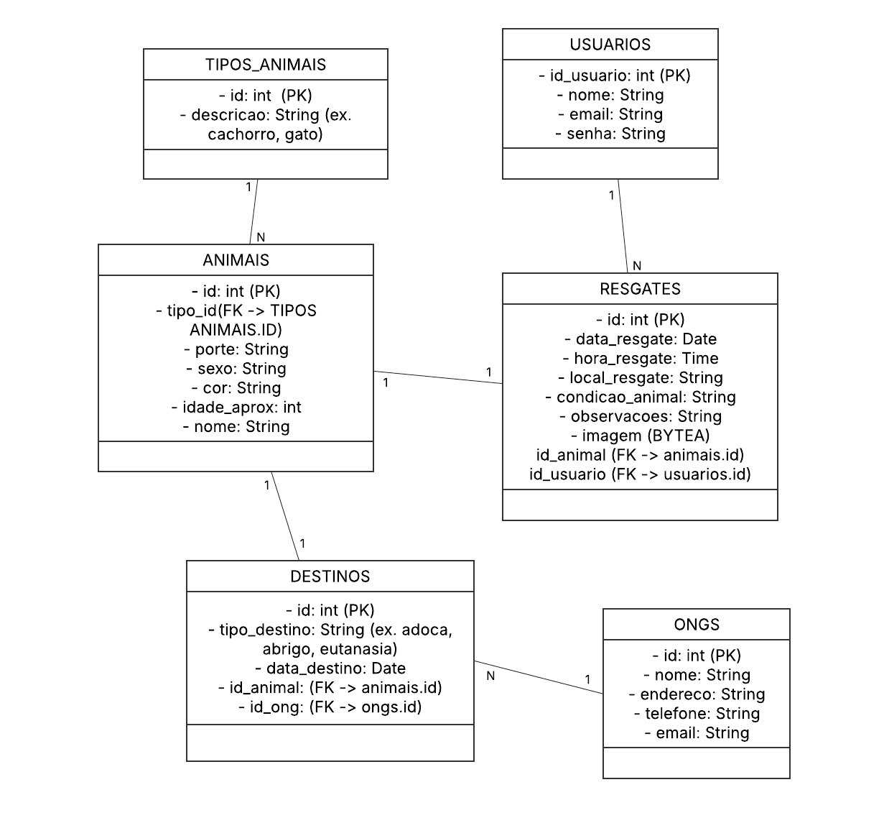

# Relatório – Marco 2  
**Data de entrega:** 18/07/2025  
**Peso:** 1  

---

## 1. Funcionalidades Implementadas  
- [x] Cadastro de resgates de animais  
- [x] Edição e exclusão de resgates  
- [x] Listagem com filtros (tipo, data, responsável)  
- [x] Anexar imagem ao resgate  
- [x] Exportar lista em CSV ou PDF  
- [x] Cadastro e login de usuários  
- [x] Restrição de acesso para usuários autenticados  
- [x] Exibição de dados do usuário logado  
- [x] Logout  

---

## 2. Banco de Dados  
- Banco utilizado: **SQLite**  
- Estrutura implementada com tabelas:
  - `usuarios`  
  - `resgates`  
  - `imagens` (separada, caso aplicável)  
- Backup e persistência local ativados  
- Relacionamentos normalizados  
- MER disponível [aqui](#5-modelo-entidade-relacionamento)

---

## 3. Protótipos de Alta Fidelidade  
- Desenvolvidos no Figma com base nos requisitos funcionais  
- Interface desktop clara, com foco em usabilidade  
- Disponível para visualização:  
  [Link para protótipo](https://www.figma.com/design/apeSHiO5btgSUoVEG7b206/Sem-t%C3%ADtulo?node-id=0-1&m=dev&t=xVhHkn03O8GdN7e2-1
  ) 

---

## 4. Demonstração das Funcionalidades  
- Demonstração em vídeo:  
  [Link para vídeo no YouTube/Drive](https://...) _(substituir com link real)_  
- Funcionalidades mostradas:
  - Login e cadastro
  - Cadastro e listagem de resgates
  - Edição, exclusão e exportação
  - Acesso restrito e logout

---

## 5. Modelo Entidade-Relacionamento  
 
---

## 6. Documentação Técnica  
- Especificação de requisitos  
- Casos de uso (ver [Casos de Uso](#6-casos-de-uso))  
- Estrutura do banco de dados  
- Estrutura do código (módulos e pastas)  
- Tecnologias utilizadas:
  - Python (Tkinter/PyQt) ou outro framework desktop  
  - SQLite  
  - Figma (protótipos)  

---

## 7. Aplicação dos Conceitos das Disciplinas  

### 7.1. Engenharia de Software  
- Levantamento e priorização de requisitos  
- Casos de uso e diagrama MER  
- Protótipos e ciclo de desenvolvimento incremental  

### 7.2. Banco de Dados  
- Modelagem relacional  
- Implementação de banco com SQLite  
- Persistência e consultas SQL  

### 7.3. Programação  
- Manipulação de dados com Python  
- Interfaces gráficas com menus e formulários  
- Exportação de arquivos e tratamento de exceções  

---

## 8. Conclusão  
O sistema encontra-se funcional com todas as entregas previstas para o Marco 2, demonstrando a integração entre as disciplinas envolvidas e atendendo aos requisitos definidos na fase inicial do projeto.

---

